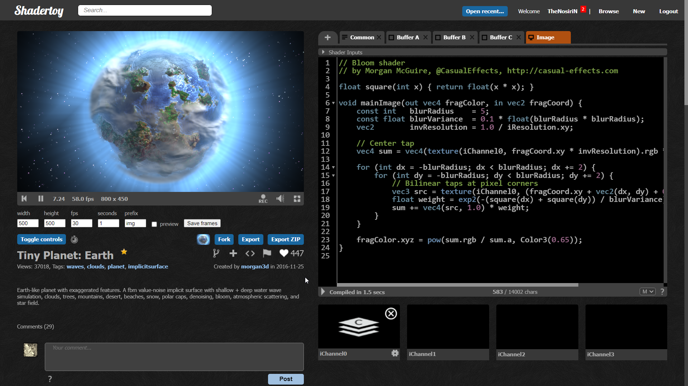
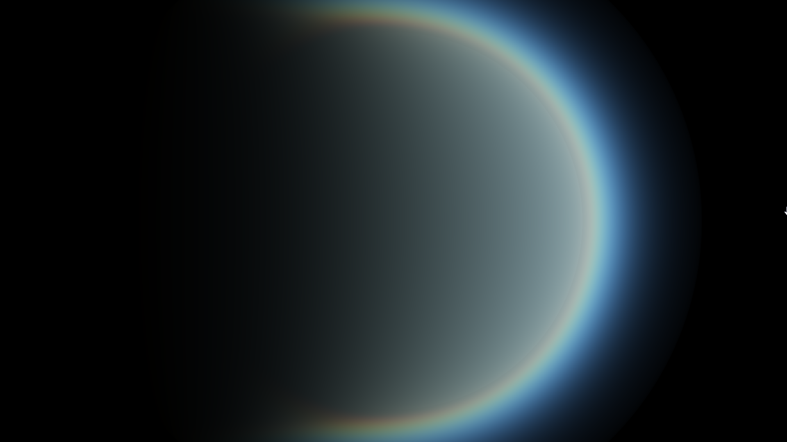
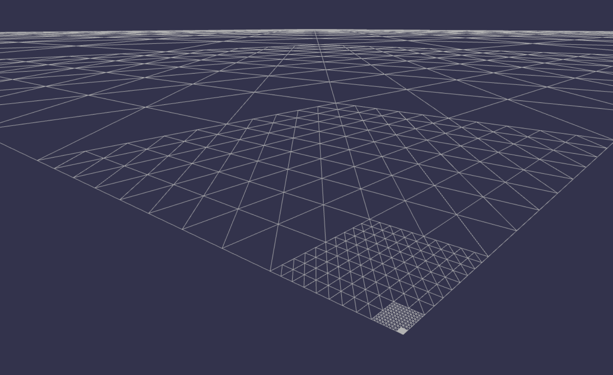
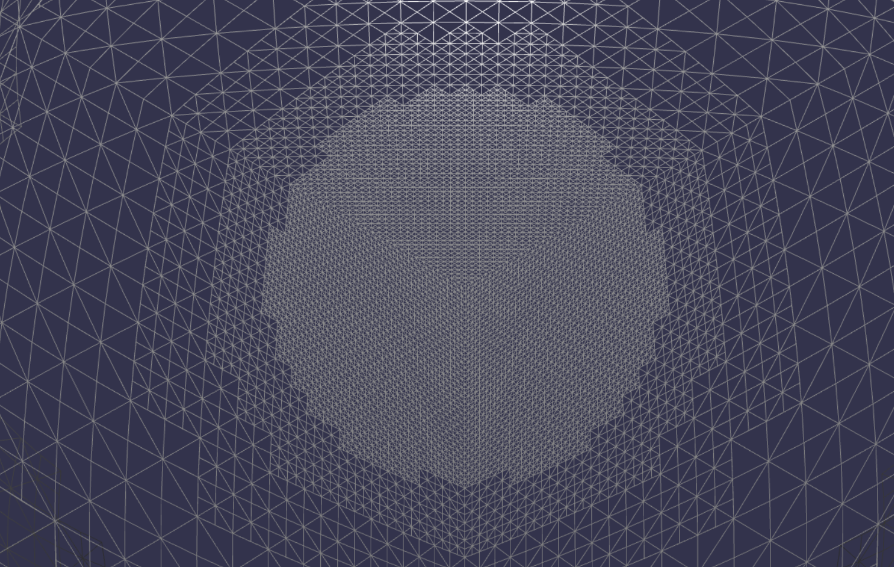
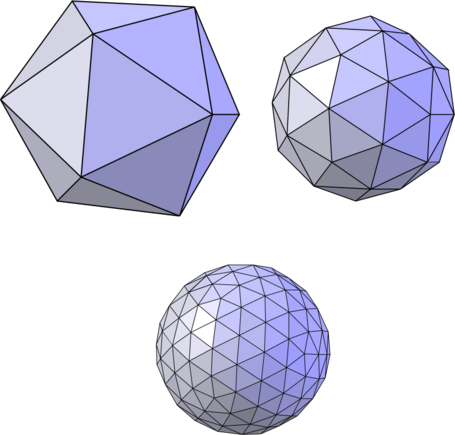
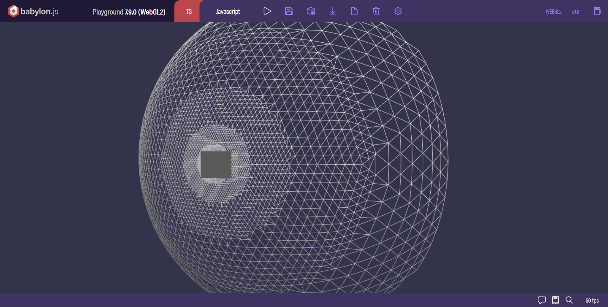

# Planets on the Web
I've always been obsessed with voxels, terrain procedural generation, and just doing grid math in code.

## Where it all started
I remember the first thing I saw that started this idea of planet generation is from a certain shader I saw on [Shadertoy](https://www.shadertoy.com/view/lt3XDM).



After I saw this I kept wondering, "how can I generate spherical terrain link this?" But that's not even where I started from, of course, as a graphics programmer, I started with making the atmosphere.

The ultimate goal at this point is making my own version of that shader. I cant lie, I had no idea what I was doing, I even tried the [naive technique](https://cyos.babylonjs.com/#SFRDCR#7) of mixing gradients on a skybox to look like a sky. Fortunately, I later found an [atmosphere shader](https://www.shadertoy.com/view/lslXDr) to work with.



But I had no idea how this shader worked. At the time I was a Graphics Programmer who had never practiced volume rendering, so I was a beginner. After a lot of tinkering I realized that atmosphere rendering is not the best place to start with.

## Spherical Terrain Generation
I decided to work on the terrain generation instead. So I opened google and searched "How to make a planet". I found [this video](https://www.youtube.com/watch?v=QN39W020LqU) by Sebastian Lague which explained how to create a sphere using the 6 faces of a cube.

So I fired up a new Babylon.js playground and copied down this function
```js
function CubeFaceToCubeSpherePoint(p, face, factor)
{
    var axisA = new BABYLON.Vector3(face.y, face.z, face.x);
    var axisB = BABYLON.Vector3.Cross(face, axisA);

    var ly = axisB.multiply( new BABYLON.Vector3().setAll((p.y) * 2) );
    var lx = axisA.multiply( new BABYLON.Vector3().setAll((p.x) * 2) );
    var pointOnCube = face.add( lx.add(ly) );
    var pointOnSphere = BABYLON.Vector3.Normalize(pointOnCube);
    var point = BABYLON.Vector3.Lerp(pointOnCube, pointOnSphere, factor);

    return new BABYLON.Vector3(point.z, point.y, point.x);
}
```
The function is called on every vertex of each plane on a cube.

Here's the link to the playground: [Babylon Playground](https://playground.babylonjs.com/#KB0HCK#3) (You won't believe how long it took to dig this up online)

So what do you do when you have a plane of vertices? Offset the height! And magic, you get terrain! Of course this was a milestone, but there was one problem, We're trying to make a planet, which means like, REALLY HUGE mountains. Unfortunately, our low poly count sphere of terrain isn't gonna work.

## Spherical Quadtrees
That's when we look at quadtrees



A Quadtree is just a structure that subdivides into **N** number of children when the data stored in it is past a threshold, then each of the subdivisions repeat this check.

You simply implement this on all 6 planes of the planet, and make the data store the distance to the player/observer, then use that to subdivide the closer it is to the player. This is what we call **Levels Of Detail (LOD)**. Check out [this playground](https://playground.babylonjs.com/#4FC29G#0) for the full implementation I made at the time.

This is a very popular technique used for planet rendering, Sebastian Lague uses it, Seed of Andromeda uses it, Elite Dangerous, and even No Man's Sky wanted to settle with it according to their GDC talk.

## The Problem with Spherical Quadtrees
Spherical Quadtrees wasn't the implementation I settled with in the end because it had some problems.

### Problem 1: Stitching
Although there are solid solutions to this problem, it's very tricky and complex to implement right. At the edge of a quadtree child node, that has a higher LOD right next to it, the node with lower vertex count may have a few triangles that connect two similar height offsets, but in reality between these offsets, there is an offset much lower in the middle, like a valley between two mountains.
Because the lower LOD doesn't have enough vertices to represent it, it creates a very visible gap at the edge of the node.

It's such a tricky problem that even well published games like No Man's Sky and many others just left the gap but lowered the height of the entire node a bit just so you won't notice. Some did fade in transitions, while others actually stitched the two LODs together, like what I did, but it was too complex to maintain.

### Problem 2: Distortion
Look at this picture:



This is where 3 planes meet. On a spherical planet it shouldn't a significant point, but do you notice something around that point? It looks weird. That's distortion. Seed of Andromeda's devlogs go more in depth about this, but the problem here is that when the observer goes to that point, they're not going to have an even distribution of LOD vertices around them, up to the point that they would only have high detail terrain only on a small path around them while the rest will look lowpoly.

Unfortunately, there is no solid solution for this, only workarounds like increasing the vertex count when arriving near that point which will impact performance.

This was the decisive factor that made me steer away from Spherical Quadtrees.

## Spherical Icosahedron LODs
But there is still hope! After about a week and half of googling, I found an ancient forum that explained a technique called Icosahedron LODs, sometimes called, Recursive Triangle LODs.

The idea behind this is the same as quadtrees except we treat each node as triangles and not as quads, so the subdivision looks a little different:



The beautiful thing about this is that we can construct an sphere using only these triangles, this is an Icosahedron.

This technique is incredibly fast, easily precomputed, and easily flattened to a for loop to make it non-recursive. To stitch the LODs together, you can just knock off a few indices at the edge of a LOD. Triangles are inserted per triangle and not per quad so knocking off some just connects the last triangle to the higher LOD. so problem 1 is fixed.

An Icosahedron Sphere has an interesting property that all triangles cover the same surface area on the sphere which is unlike all other types of spheres. Therefore no distortions, which fixes problem 2.



The full implementation can be found in [this playground](https://playground.babylonjs.com/#ZU2FWP#105)

Of course no technique is perfect, this one has its own problems as well. The main problem is performance. I know I said its incredibly fast above, which it is, its fast to rebuild, but you would have to rebuild the entire planet every time the player moves.
In the Quadtree technique, I managed to optimize the rebuild by making each LOD its own mesh and not rebuilding the LODs that the player wont notice have changed. You cant do the same here, an Icosahedron sphere has to built all at once, as a whole.

In the end I still stuck with Spherical Icosahedron LODs because of its simplicity.

## The Atmosphere
